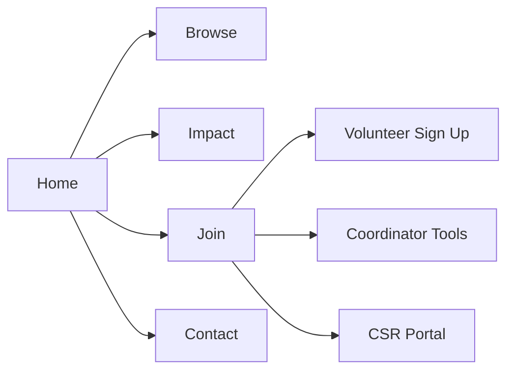
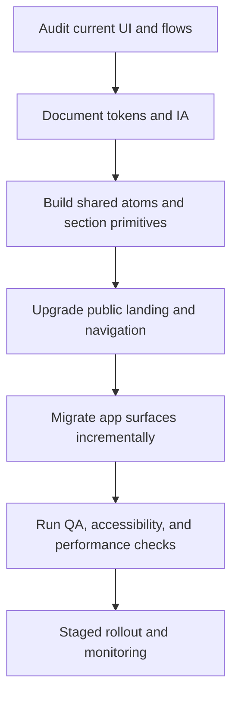

# Frontend Rollout Plan

## Information Architecture

## Migration Flow

## QA Checklist

- Functional:
  - Validate homepage CTAs route to existing flows.
  - Verify auth, volunteer, command center, and CSR routes still load.
  - Confirm filters can be applied and reset without errors.
- Accessibility:
  - Test keyboard navigation from header through footer.
  - Verify visible focus states.
  - Confirm contrast and readable text scaling.
  - Confirm reduced-motion behavior remains acceptable.
- Performance:
  - Run `npm run build`.
  - Track Lighthouse scores for the public route.
  - Verify no large layout shift from sticky navigation.
- Analytics:
  - Confirm CTA events push structured entries into `window.dataLayer`.

## Rollout Metrics

- Lighthouse accessibility: `>= 95`
- Lighthouse performance: `>= 90`
- Core Web Vitals:
  - LCP `< 2.5s`
  - CLS `< 0.1`
  - INP `< 200ms`
- Product metrics:
  - Higher CTA click-through on the landing page
  - Lower drop-off on volunteer sign-up entry
  - Fewer support requests related to navigation confusion

## Release Notes Template

- Introduced a documented design system with reusable tokens and section primitives.
- Rebuilt the public landing route into a clearer single-page IA.
- Added analytics-ready CTA tracking hooks.
- Improved accessibility with better navigation hierarchy, skip links, and mobile filter handling.
